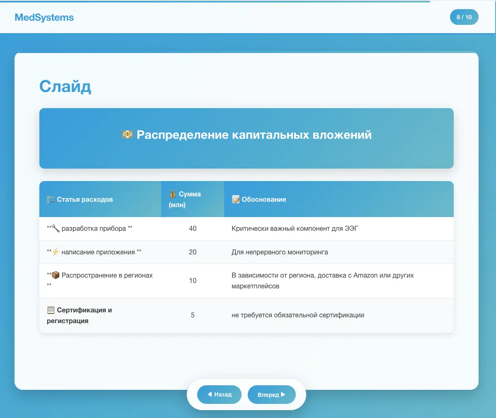

# Presentation Builder

Современный шаблонизатор HTML презентаций с поддержкой Markdown и GSAP анимаций.

- 
- [example.html](example.html)

## ✨ Особенности

- 📝 **Markdown-based контент** с Front Matter метаданными
- ⚡ **GSAP анимации** при переходах между слайдами
- 📱 **Полностью адаптивный дизайн** (mobile-first для viewport < 500px)
- 🎨 **Фирменный стиль Медпродактс** с градиентами и карточками
- 📦 **Автономный HTML файл** для отправки в Telegram
- 🎯 **5 типов слайдов**: title, content, stats, table, info-grid

## 🚀 Быстрый старт

```bash
# Установить Bun.js (если не установлен)
curl -fsSL https://bun.sh/install | bash

# Установить зависимости
bun install

# Запуск в dev режиме
bun run dev

# Сборка production версии
bun run build
```

## 📁 Структура проекта

```
presentation-builder/
├── package.json          # Зависимости и скрипты
├── bunfig.toml           # Конфигурация Bun.js
├── .eslintrc.json        # Настройки ESLint для JSX
├── app.js                # Development сервер
├── build.js              # Production сборщик
├── index.html            # Dev HTML
├── data/
│   └── presentation.md   # Markdown данные презентации
├── src/
│   ├── PresentationApp.jsx      # Основное приложение
│   ├── components/              # React компоненты
│   │   ├── Navigation.jsx
│   │   ├── ProgressBar.jsx
│   │   └── SlideRenderer.jsx
│   ├── templates/               # Шаблоны слайдов
│   │   ├── TitleSlide.jsx
│   │   ├── ContentSlide.jsx
│   │   ├── StatsSlide.jsx
│   │   ├── TableSlide.jsx
│   │   └── InfoGridSlide.jsx
│   ├── styles/
│   │   ├── base.css             # Основные стили
│   │   └── mobile.css           # Мобильная адаптация
│   └── utils/
│       ├── markdownParser.js    # Парсер MD в слайды
│       └── markdownLoader.js    # Загрузчик данных
└── dist/
    └── index.html        # Готовая презентация (после build)
```

## 📝 Формат Markdown

### Базовая структура слайда:

```markdown
---
type: content
title: Заголовок слайда
subtitle: Подзаголовок (опционально)
---

# Основной контент слайда

Обычный markdown контент...

---
```

### 5 типов слайдов:

#### 1. **Title** - титульный слайд

```markdown
---
type: title
title: Название презентации
subtitle: Подзаголовок
date: Сентябрь 2025
author: Автор презентации
---
```

#### 2. **Stats** - слайд со статистикой

```markdown
---
type: stats
title: Финансовые показатели
stats:
  - value: 2.7 млн $
    label: NPV при 10%
    change: +12%
  - value: 43%
    label: EBITDA маржа
---
```

#### 3. **Info-Grid** - слайд с карточками

```markdown
---
type: info-grid
title: Ключевые преимущества
cards:
  - title: Технологические
    content: Возможность непрерывного мониторинга ЭЭГ
    icon: 🔬
---
```

#### 4. **Table** - слайд с таблицами

```markdown
---
type: table
title: Структура инвестиций
subtitle: 5 млн $ общий объем
---

| Статья     | Сумма | Обоснование               |
| ---------- | ----- | ------------------------- |
| Прибор     | 3 млн | Физический носитель       |
| Приложение | 2 млн | Необходимость мониторинга |
```

#### 5. **Content** - обычный слайд (по умолчанию)

```markdown
---
type: content
title: Заголовок
---

# Markdown контент

Обычный текст, списки, изображения...
```

### 🎨 Специальные расширения:

```markdown
{animate}
Контент с анимацией появления
{/animate}

{highlight}
Выделенный блок с фирменным фоном
{/highlight}

{stat:100500}Подпись к метрике{/stat}

{card:Заголовок}Содержимое карточки{/card}
```

## 🔧 Настройка

### Изменение фирменных цветов:

Отредактируйте `src/styles/base.css`:

```css
:root {
  --primary-blue: #00cc55;
  --turquoise: #00ea61;
  --dark-gray: #434342; /* Темно-серый */
  --white: #fefefe; /* Белый */
}
```

### Мобильная адаптация:

`src/styles/mobile.css` автоматически применяется для viewport < 500px:

- Одноколоночная сетка карточек
- Уменьшенные отступы и шрифты
- Адаптированная навигация

## 🎮 Управление

- **← / →** - переход между слайдами
- **Home** - первый слайд
- **End** - последний слайд
- **Пробел** - следующий слайд
- **Кнопки навигации** - мышь/тач

## 📦 Сборка

Команда `bun run build` создает единый `dist/index.html` со встроенными:

- React и ReactDOM из CDN
- GSAP из CDN
- Все стили (CSS)
- Все компоненты (JS)
- Данные презентации (Markdown)

Файл полностью автономный и работает в Telegram!

## 🛠️ Устранение неполадок

### Ошибка "JSX syntax extension is not currently enabled":

Проверьте файлы конфигурации:

- `bunfig.toml` настроен для JSX
- `.eslintrc.json` содержит правила для React
- В `package.json` правильные скрипты

### Не загружаются данные в dev режиме:

Убедитесь что файл `data/presentation.md` существует и доступен по HTTP.

### Анимации не работают:

GSAP подключается из CDN. Проверьте интернет-соединение или замените на локальную версию.

---

Проект готов к использованию! 🚀
